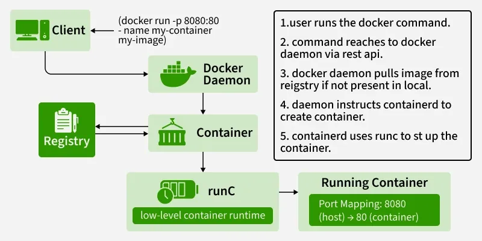

# 🏗️ Docker Architecture Complete Guide

## 📋 Table of Contents
- [Components Overview](#components-overview)
- [Docker Workflow](#docker-workflow)
- [Practical Examples](#practical-examples)
- [Architecture Summary](#architecture-summary)

---

## 🔹 Components of Docker & Their Purpose

### 1. **Docker Client (CLI / API)**
- **Purpose:** Tool you use to talk to Docker
- **Examples:** `docker run`, `docker ps`, `docker build`
- **Function:** Sends commands to the **Docker Daemon**
- **Types:** 
  - Command Line Interface (CLI)
  - REST API
  - Docker Desktop GUI

### 2. **Docker Daemon** (`dockerd`)
- **Purpose:** Core service running in the background
- **Function:** Listens to Docker API requests
- **Responsibilities:**
  - Builds images
  - Runs containers
  - Manages networks & volumes
  - Handles container lifecycle
- **Location:** Usually runs on the host system

### 3. **Docker Images**
- **Purpose:** Read-only templates (blueprints)
- **Structure:** Built using **Dockerfiles** (layered structure)
- **Examples:** `node:18`, `postgres:16`, `ubuntu:22.04`
- **Characteristics:**
  - Immutable
  - Shareable
  - Version-controlled with tags

### 4. **Docker Containers**
- **Purpose:** Running instance of an image
- **Characteristics:**
  - Lightweight, isolated process
  - Own filesystem, network, and resources
  - Can be started, stopped, moved, and deleted
- **Lifecycle:** Created → Running → Stopped → Removed

### 5. **Docker Registries**
- **Purpose:** Store & share Docker images
- **Examples:**
  - **Docker Hub** (public registry)
  - **AWS ECR** (Elastic Container Registry)
  - **GitHub Container Registry**
  - **Azure Container Registry**
- **Operations:** Push, pull, search images

### 6. **Docker Networks**
- **Purpose:** Allow containers to communicate with each other
- **Types:**
  - `bridge` (default) - isolated network on host
  - `host` - uses host's network directly
  - `overlay` - multi-host networking
  - `none` - no networking
- **Features:** DNS resolution, port mapping, network isolation

### 7. **Docker Volumes**
- **Purpose:** Persistent storage for containers
- **Use Cases:**
  - Store PostgreSQL database files
  - Share data between containers
  - Backup and restore data
- **Types:**
  - Named volumes
  - Anonymous volumes
  - Bind mounts

---

## 🔹 Docker Workflow (Step by Step)

### Architecture Flow Diagram
```
┌─────────────┐    API calls    ┌──────────────┐
│ Docker      │ ──────────────> │ Docker       │
│ Client      │                 │ Daemon       │
│ (CLI/API)   │ <────────────── │ (dockerd)    │
└─────────────┘    responses    └──────────────┘
                                        │
                                        ▼
                    ┌─────────────────────────────────────┐
                    │            Manages                  │
                    ▼                                     ▼
        ┌─────────────────┐                   ┌─────────────────┐
        │ Images          │                   │ Containers      │
        │ - Templates     │                   │ - Running       │
        │ - Layers        │                   │ - Processes     │
        └─────────────────┘                   └─────────────────┘
                    │                                     │
                    ▼                                     ▼
        ┌─────────────────┐                   ┌─────────────────┐
        │ Registry        │                   │ Networks &      │
        │ - Docker Hub    │                   │ Volumes         │
        │ - Private Reg   │                   │ - Storage       │
        └─────────────────┘                   └─────────────────┘
```

---

## 🚀 Practical Examples

### Example 1: Running a Web Server
**Command:** `docker run -d -p 8080:80 nginx`

**Step-by-Step Workflow:**
1. **Client (CLI):** Sends the command → "Run an `nginx` container"
2. **Daemon:** Checks if `nginx` image exists locally
   - If not found → pulls from Docker Hub (registry)
   - Downloads all required layers
3. **Daemon:** Creates a container from the `nginx` image
   - Filesystem based on image layers
   - Network namespace assigned
   - Host port `8080` mapped to container port `80`
4. **Daemon:** Starts the container's default process (`nginx -g 'daemon off;'`)
5. **User:** Opens `http://localhost:8080` → sees Nginx welcome page

### Example 2: Building Custom Image
**Command:** `docker build -t myapp .`

**Step-by-Step Workflow:**
1. **Client:** Sends request to build an image
2. **Daemon:** Reads the **Dockerfile** in current directory
   ```dockerfile
   FROM node:18
   COPY package.json .
   RUN npm install
   COPY . .
   EXPOSE 3000
   CMD ["npm", "start"]
   ```
3. **Daemon:** Builds image step by step (layers)
   - Each Dockerfile instruction creates a new layer
   - Layers are cached for faster subsequent builds
4. **Daemon:** Stores the image locally with tag `myapp:latest`
5. **User:** Can now run `docker run myapp`

### Example 3: Checking Running Containers
**Command:** `docker ps`

**Step-by-Step Workflow:**
1. **Client:** Asks daemon → "Show me running containers"
2. **Daemon:** Queries internal container state
3. **Daemon:** Returns container list with:
   - Container IDs
   - Image names
   - Command being run
   - Creation time
   - Status
   - Port mappings
   - Container names
4. **User:** Sees the status of all running containers

---

## ✅ Architecture Summary

### The Complete Workflow Pattern:
```
User (Client) → Docker Daemon → Registry/Images → Containers/Networks/Volumes → Back to User
```

### Key Relationships:
- **Client** communicates with **Daemon** via REST API
- **Daemon** manages all Docker objects (images, containers, networks, volumes)
- **Images** are pulled from **Registries** when needed
- **Containers** are created from **Images**
- **Networks** enable **Container** communication
- **Volumes** provide persistent storage for **Containers**

### Communication Flow:
1. **User Input:** Commands via CLI or API
2. **Processing:** Daemon interprets and executes
3. **Resource Management:** Images, containers, networks, volumes
4. **External Communication:** Registry for image pulls/pushes
5. **Response:** Results back to user

---

## 🔧 Quick Reference

### Essential Architecture Commands:
```bash
# Check Docker daemon status
docker version
docker info

# Image management
docker images
docker pull <image>
docker build -t <tag> .

# Container management
docker ps
docker run <options> <image>
docker exec -it <container> <command>

# Network management
docker network ls
docker network create <network>

# Volume management
docker volume ls
docker volume create <volume>
```

### Architecture Best Practices:
- Keep images small and focused
- Use multi-stage builds for optimization
- Implement proper networking strategies
- Use volumes for persistent data
- Regular cleanup of unused resources
- Monitor daemon resource usage

---

**Understanding Docker architecture is crucial for:**
- Troubleshooting container issues
- Optimizing Docker performance
- Designing scalable containerized applications
- Implementing proper security practices
- Making informed architectural decisions