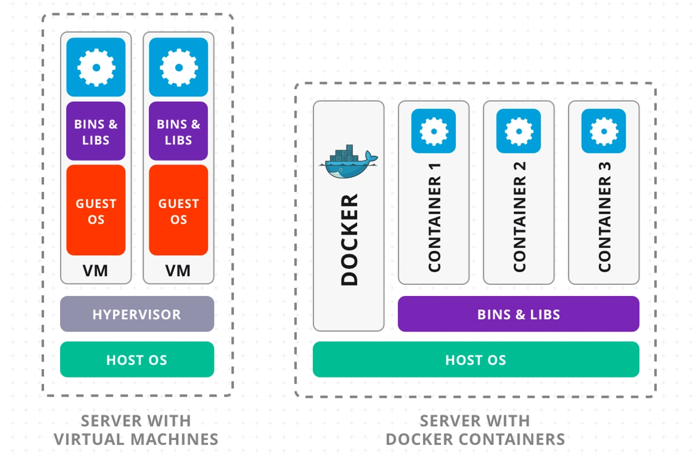

# 🚀 Why Docker Came?

Before Docker, developers and system admins faced big challenges:

## Problems Before Docker

### "It works on my machine" problem 🖥️
An app might run fine on a developer's computer but fail in testing/production because of different OS versions, dependencies, or libraries.

### Complex environment setup ⚙️
Installing correct versions of Java, Node.js, Python, databases, and their dependencies was painful.

### Slow & heavy Virtual Machines (VMs) 💾
VMs solved some problems by isolating apps, but they used entire OS images, making them large, slow, and resource-hungry.

### Difficult app portability 🌍
Moving applications between environments (dev → test → production, or even between cloud providers) was error-prone.

**Docker was created to package applications and their dependencies into lightweight containers, making them portable, fast, and consistent across all environments.**

## 🌟 Why Docker Became Popular?

Docker exploded in popularity because it solved those pain points:

### Lightweight compared to VMs 🪶
Containers share the host OS kernel → no need for a full guest OS → faster startup & less resource usage.

### Consistency ✅
Same container image runs everywhere (developer laptop, CI/CD server, cloud).

### Portability 🚀
Works across Linux, Windows, Mac, on-premises, or in any cloud provider.

### Scalability 📈
Easy to spin up multiple container replicas for load balancing and scaling.

### Ecosystem & Community 🌍
Docker Hub (pre-built images), Compose (multi-container apps), Swarm/Kubernetes (orchestration) → strong ecosystem.

### DevOps & CI/CD Integration 🔄
Became the backbone of modern DevOps workflows for testing, building, and deploying apps automatically.

## ✅ In Short

- **Problem:** Dependency hell, inconsistent environments, heavy VMs
- **Solution:** Docker → Lightweight, portable, consistent containers
- **Result:** Faster development, easier deployments, cloud-native scalability

---

## ⚖️ Virtual Machines vs Containers

### 🖥 Virtual Machines (VMs)

Each VM has:
- Full guest OS (Linux/Windows)
- App + dependencies
- Runs on a hypervisor (like VMware, VirtualBox, Hyper-V)

**Pros:** Strong isolation, can run different OS types on same host  
**Cons:** Heavy (GBs in size), slow startup, resource-hungry

### 📦 Containers (Docker)

Each container has:
- App + dependencies
- Shares the host OS kernel
- Runs on Docker Engine (not a hypervisor)

**Pros:** Lightweight (MBs in size), fast startup (seconds), efficient resource usage, portable  
**Cons:** Weaker isolation compared to VMs (shares host kernel)

## 📊 Quick Comparison

| Feature | Virtual Machine 🖥 | Container 📦 |
|---------|-------------------|---------------|
| **Size** | GBs | MBs |
| **Startup Time** | Minutes | Seconds |
| **Isolation** | Strong (full OS) | Medium (shared kernel) |
| **Performance** | Slower (more overhead) | Faster (lightweight) |
| **Portability** | Limited | Very high |
| **Resource Usage** | Heavy (each VM = full OS) | Efficient (shared OS) |

## 🔑 Key Idea

- **VMs** → Emulate hardware, run entire OS for each app
- **Containers** → Share OS, isolate apps at process level

Docker made containers super easy to use, which is why they exploded in popularity.

