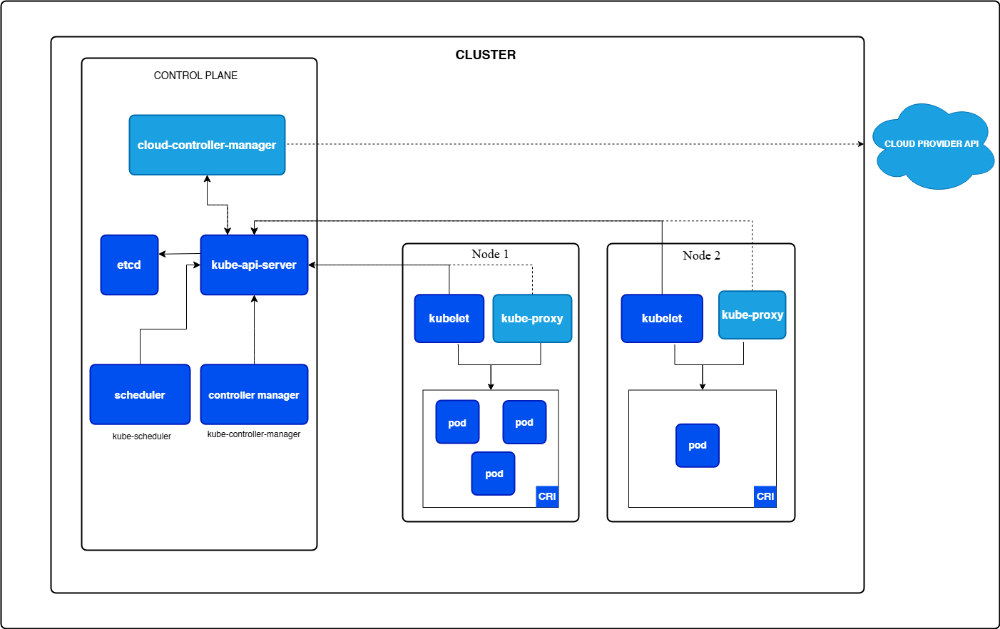

# Kubernetes Cluster Overview - Study Notes

## 🔹 Kubernetes Cluster Overview

At the highest level, a Kubernetes cluster is made of two logical parts:

### Control Plane (The Brain 🧠)
- Decides what should happen in the cluster
- Maintains the desired state (what you told it to run)
- Schedules Pods, manages scaling, handles failures

### Worker Nodes (The Muscles 💪)
- Actually run your applications (Pods/containers)
- Report health & resource usage back to the control plane
- Handle networking and load balancing for traffic to Pods

## 🔹 How the Cluster Functions (Step by Step)

### 1. User Request
You apply a YAML configuration:
```bash
kubectl apply -f deployment.yaml
```
**Example:** "I want 3 replicas of my Nginx app."

### 2. API Server
- The request goes to the API Server, which is the entry point to the cluster
- It validates and stores your desired state in etcd (the database)

### 3. Scheduler
- Looks for available worker nodes with enough CPU/RAM
- Decides where each Pod should run

### 4. Kubelet (on each worker node)
- Receives instructions: "Run this Pod here"
- Talks to the container runtime (like Docker/Containerd) to start the container

### 5. kube-proxy (on each worker node)
- Handles networking rules so traffic can reach the Pods
- Works with Services to do load balancing

### 6. Controller Manager
- Keeps watching the cluster
- If a Pod crashes, it ensures a new one is created
- Ensures "actual state = desired state"

### 👉 Continuous Loop
This loop continues all the time:
**Desired State (etcd) vs Actual State (cluster reality)**

Control Plane keeps correcting differences automatically.

## 🔹 Control Plane Components (The Brain)

### API Server
- The gateway to the cluster (all kubectl requests come here)
- Reads/writes cluster state from etcd
- Other components only talk to API Server, not etcd directly

### etcd
- A distributed key–value store
- Stores the entire cluster state (Pods, Nodes, Configs)
- **Must be backed up** → if lost, the cluster "forgets" everything

### Scheduler
- Assigns Pods to Nodes based on resources and constraints
- **Example:** "Pod A needs 2 CPUs → best fit is Node-2"

### Controller Manager
Runs controllers (loops that reconcile state):
- **Deployment Controller** → ensures replicas = desired count
- **Node Controller** → marks nodes as "Not Ready" if they stop reporting
- **Job Controller** → ensures batch jobs finish

### Cloud Controller Manager (in cloud setups)
- Integrates with cloud provider APIs (e.g., AWS, GCP, Azure)
- Manages load balancers, storage, node provisioning

## 🔹 Worker Node Components (The Muscles)

### Kubelet
- Agent that runs on every worker node
- Talks to API Server: "Tell me which Pods to run"
- Talks to container runtime (Docker/Containerd) to start/stop containers

### kube-proxy
- Handles Pod networking & Services
- Ensures traffic is properly routed to Pods, even across nodes
- Can do simple load balancing

### Container Runtime
- Software that actually runs containers (Docker, containerd, CRI-O)
- Kubernetes doesn't run containers itself — it asks the runtime to do it

## 🔹 Cluster Mental Model

| Component | Role | Analogy |
|-----------|------|---------|
| **Control Plane** | Decides, plans, records | Brain 🧠 |
| **Worker Nodes** | Do the actual work, run apps | Muscles 💪 |
| **etcd** | Remembers everything | Memory 📂 |
| **API Server** | All requests go through here | Receptionist 🧑‍💼 |

## 📝 Key Interview Points to Remember

### Control Plane Deep Dive
1. **API Server is the single source of truth**: Everything flows through it, no direct etcd access
2. **etcd is the persistence layer**: Distributed, consistent, needs backup strategy
3. **Scheduler makes placement decisions**: Considers resources, constraints, policies
4. **Controllers implement reconciliation**: Watch → Compare → Act loop pattern
5. **Cloud Controller Manager enables portability**: Abstracts cloud-specific operations

### Worker Node Deep Dive
1. **Kubelet is the node agent**: Manages complete pod lifecycle, not just containers
2. **kube-proxy enables Services**: Implements cluster networking via iptables/IPVS
3. **Container Runtime handles execution**: CRI interface allows pluggable runtimes
4. **CNI manages pod networking**: Each pod gets its own IP address
5. **CSI handles persistent storage**: Volumes that survive pod restarts

### Component Interactions
1. **API Server ↔ etcd**: Only direct database communication
2. **Scheduler → API Server**: Gets unscheduled pods, updates with node assignment
3. **Controllers → API Server**: Watch for changes, update resource status
4. **Kubelet → API Server**: Reports node/pod status, gets pod specs
5. **kube-proxy → API Server**: Watches Services/Endpoints, updates network rules

## 🎯 Common Interview Questions

**Q: What happens when you run `kubectl apply -f deployment.yaml`?**

**Detailed Flow:**
1. **kubectl** sends HTTP request to **API Server**
2. **API Server** validates YAML, authenticates user, runs admission controllers
3. **API Server** stores Deployment object in **etcd**
4. **Deployment Controller** sees new Deployment, creates ReplicaSet
5. **ReplicaSet Controller** sees new ReplicaSet, creates Pods
6. **Scheduler** sees unscheduled Pods, assigns them to nodes
7. **Kubelet** on assigned nodes sees new Pods, pulls images
8. **Container Runtime** creates containers, **CNI** sets up networking
9. **kube-proxy** updates networking rules for any new Services

**Q: How does a Service work internally?**

**Answer:**
1. Service creates virtual IP (ClusterIP) stored in etcd
2. Endpoints controller creates Endpoints object listing pod IPs
3. kube-proxy on each node watches Services/Endpoints
4. kube-proxy programs iptables/IPVS rules: ClusterIP → Pod IPs
5. When traffic hits ClusterIP, kernel routes it to healthy pod
6. No actual proxy in the path (iptables/IPVS mode)

**Q: What if etcd fails?**

**Answer:**
- **Immediate Impact**: No new workloads can be scheduled, existing continue running
- **API Operations**: All kubectl commands fail (can't read/write cluster state)  
- **Controller Impact**: Controllers stop working, no reconciliation
- **Service Discovery**: Existing connections work, new connections may fail
- **Recovery**: Restore from backup, or rebuild cluster state

**Q: How does the Scheduler make decisions?**

**Answer:**
1. **Filtering Phase**: Eliminate unsuitable nodes
   - Resource requirements (CPU/memory requests)
   - Node selectors, affinity/anti-affinity rules
   - Taints and tolerations
   - Volume requirements
2. **Scoring Phase**: Rank remaining nodes (0-100 points)
   - Resource utilization balance
   - Spreading across zones/nodes
   - Image locality (prefer nodes with cached images)
   - Custom scheduler plugins
3. **Selection**: Pick highest-scoring node (random if tied)

**Q: What's the difference between Deployment and ReplicaSet Controllers?**

**Answer:**
- **ReplicaSet Controller**: Ensures desired number of identical pods are running
- **Deployment Controller**: Manages ReplicaSets for rolling updates
  - Creates new ReplicaSet for updates
  - Gradually scales new ReplicaSet up, old one down
  - Handles rollback by scaling old ReplicaSet back up
  - Maintains revision history

**Q: How does kubelet know what to run?**

**Answer:**
1. **API Server Communication**: kubelet polls API Server every 20s
2. **Pod Specs**: Gets list of pods scheduled to its node
3. **Desired State**: Compares current containers vs desired pods
4. **Reconciliation**: Starts/stops containers to match desired state
5. **Status Reporting**: Reports pod/container status back to API Server
6. **Health Checks**: Runs probes, restarts failed containers

**Q: What happens during a rolling update?**

**Answer:**
1. **New ReplicaSet**: Deployment Controller creates new ReplicaSet (0 replicas)
2. **Gradual Scale**: Increment new ReplicaSet, decrement old ReplicaSet
3. **Pod Replacement**: 
   - Create new pod on new ReplicaSet
   - Wait for it to be Ready
   - Terminate old pod from old ReplicaSet
   - Repeat until all replaced
4. **Rollout Strategy**: Controlled by maxSurge and maxUnavailable settings
5. **Health Checks**: Readiness probes determine when pods are ready for traffic

**Q: How do you troubleshoot a failing pod?**

**Systematic Approach:**
```bash
# 1. Check pod status
kubectl get pods -o wide

# 2. Describe pod for events
kubectl describe pod <pod-name>

# 3. Check logs
kubectl logs <pod-name> -c <container-name>

# 4. Check node resources
kubectl describe node <node-name>

# 5. Check kubelet logs
journalctl -u kubelet

# 6. Check if image can be pulled
kubectl run test --image=<same-image> --rm -it
```

**Common Issues:**
- **ImagePullBackOff**: Wrong image name/tag, registry auth issues
- **CrashLoopBackOff**: Application crashes on startup, check logs
- **Pending**: Resource constraints, scheduling issues, PVC not bound
- **CreateContainerConfigError**: ConfigMap/Secret not found