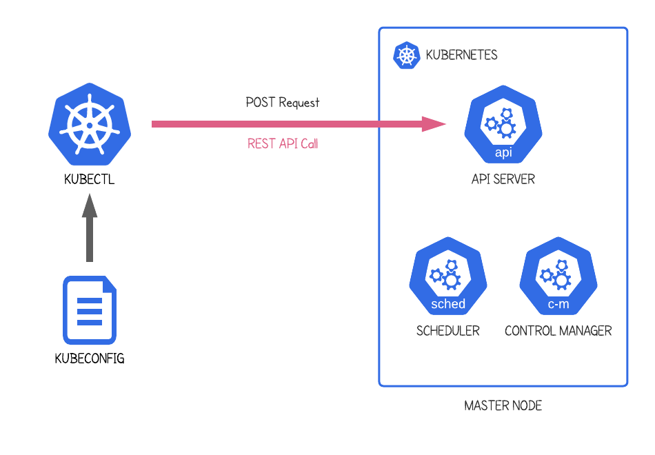

# 📂 Kubernetes Kubeconfig

## 🔹 What is a Kubeconfig?
A **kubeconfig file** is the client-side configuration that tells `kubectl` (or any Kubernetes client):

- **Which cluster** to connect to  
- **Which user credentials** to use  
- **Which namespace** to use by default  

It is how Kubernetes clients know *where* and *as whom* to operate.

---

## 🔹 Structure of a Kubeconfig
A kubeconfig file is YAML and typically contains four main sections:

- **clusters:** connection info for API servers (URLs, certificates).  
- **users (authinfos):** authentication data (certs, tokens, plugins).  
- **contexts:** combination of cluster + user + namespace.  
- **current-context:** the context used by default.

📌 Example:
```yaml
apiVersion: v1
kind: Config
clusters:
- name: my-cluster
  cluster:
    server: https://1.2.3.4:6443
    certificate-authority: /path/to/ca.crt

users:
- name: alice
  user:
    client-certificate: /path/alice.crt
    client-key: /path/alice.key

contexts:
- name: dev-context
  context:
    cluster: my-cluster
    user: alice
    namespace: development

current-context: dev-context
```

---

## 🔹 Why `kubectl` Uses Kubeconfig
- Keeps cluster connection info separate from the client.  
- Supports multiple clusters/environments in one file.  
- Central place for security credentials.  
- Easy to switch between contexts.  
- Portable across machines.

---

## 🔹 How `kubectl` Uses It
1. Reads the kubeconfig (from `--kubeconfig`, `KUBECONFIG` env, or `~/.kube/config`).  
2. Determines the active **context**.  
3. Resolves the **cluster** (API server address, TLS).  
4. Resolves the **user** (credentials).  
5. Sends HTTPS requests to the API server with that identity.  

---

## 🔹 Locations & Precedence
- Default: `~/.kube/config`  
- Override with:
  - `kubectl --kubeconfig=/path/file ...`  
  - `KUBECONFIG=/path/a:/path/b ...` (merges files)  

Later files take precedence when merging.

---

## 🔹 Common Credential Methods
- Client certificates (`client-certificate`, `client-key`).  
- Bearer tokens.  
- Exec plugins (dynamic tokens via cloud CLIs).  
- Cloud provider auth-helpers.  

---

## 🔹 Security Best Practices
- Restrict file permissions: `chmod 600 ~/.kube/config`.  
- Use short-lived tokens (OIDC/exec plugin).  
- Don’t commit kubeconfig to repos.  
- Separate contexts for dev/staging/prod.  

---

## 🔹 Useful Commands
```bash
kubectl config get-contexts           # List contexts
kubectl config current-context        # Show current
kubectl config use-context NAME       # Switch context
kubectl config view --raw             # Show full config
kubectl --kubeconfig=FILE get pods    # Use a specific config
```

---

✅ **Summary**  
The kubeconfig file is the **bridge** between your `kubectl` client and the Kubernetes cluster. It defines the **who, where, and what namespace** for every command you run.
